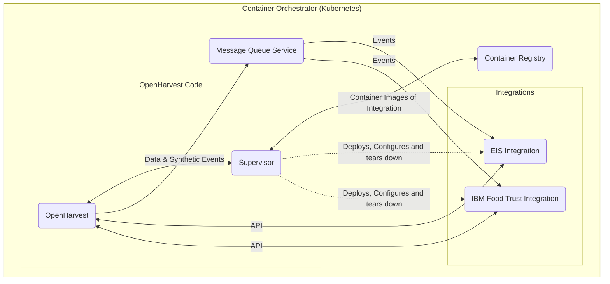

# OpenHarvest Architecture and Vision

This document outlines the intended architecture and future vision for OpenHarvest (aka OH).
It covers subjects such as:

- Key Features
- Deliberate Architectural Decisions
- Ideals and "Blue Sky" vision that should guide OpenHarvest decision making in the future.

## Key Purpose of OpenHarvest

The first topic we should cover is the purpose what need OpenHarvest caters to.

Our Purpose in a single line (probably going to evolve):

A central point of integration for various agricultural systems that is extensible in data, events and the UI.

It is designed to be easily integrated into other software.

## Key Features of OpenHarvest

1. The main purpose of OpenHarvest is to serve as a central integration point between several different platforms.
2. It is a dashboard and control centre for data related to Coops and organisations of Farmers.
3. OpenHarvest should be extensible in several different areas:
   1. Data should be imported and exported via APIs to other systems
   2. OpenHarvest Events will notify other systems about new data or other events
   3. Integrations will be able to add data to display on the UI along side OpenHarvest Core / Primitive data

Looking at other successful open source software it is reminiscent of the Unix philosophy of which an extract is:

- Make each program do one thing well.
- Expect the output of every program to become the input to another, as yet unknown, program.

Several examples of open source software are building blocks that have one purpose but are also meant
to be used with other tools to build functionality on top of each other. The Kubernetes ecosystem is a
fantastic example of this idea where Kubernetes handles the hard task of orchestrating containers but it
provides API's and configuration to allow external services like Istio to supplement or even replace
existing functionality.

I think this methodology suits an integration platform like OpenHarvest almost perfectly and it would
do us well to keep it in mind as we continue to develop the platform.

## Example of other applications that share goals and/or functionality with OpenHarvest

Examples of technologically similar systems in various fields:

- Home Assistant: https://www.home-assistant.io/
  - Home Assistant brings together a myriad of Smart Home technology and automation in a single UI.
  - Extensible with "Integrations"
    - Provide functionality related to the integration
    - Expose state of integration to Home Assistant
    - https://developers.home-assistant.io/docs/creating_component_index/
  - Pub / Sub Event Bus
    - https://www.home-assistant.io/docs/configuration/events/
  - State managed through primitives called Entities
- Kubernetes:

Example of similar functionally:

- Yara Farming
  - https://www.yara.com/crop-nutrition/digital-farming/
  - https://www.ibm.com/services/client-stories/yara
- There are more...

## OpenHarvest Data Primitives

I want to introduce the concept of data primitives in OpenHarvest. A data primitive is a structure of data
that can be moved around and is guaranteed (by OpenHarvest) to come with certain attributes as part of it.
OpenHarvest and other integrations build on top of the data primitive and add computed data
(for example analytics), context data (e.g. sensor, weather data) and functionality (e.g. UI layout and structure)

The name is borrowed from languages where primitives are a set of basic data types from which other data is constructed.

The data primitives and their attributes currently planned for OpenHarvest are:

1. Coop Organisation
   1. Name
   2. Location
2. Farmer
   1. Name
   2. Mobile / contact details
3. Fields & Subfields
   1. Location
   2. Crops Planted on the field
4. Crops
   1. Name
   2. Planting Season / Dates

## Integration Structure

External Software would need at some point to attach their own data to our own data primitives, this could be
an ID in their system or some sensor data. This integration could be displayed on the OpenHarvest UI (provided
the integrator declare the data in a standard way) and also used by other integrations.

For now I'm proposing a simple solution to this. On each of our data primitives we have a field called integrations
and leveraging the NoSQL nature of our data we can add integration data under this field namespaced to the integration name.
For example for EIS data and soil sensor data we can have this:

```jsonc
// Field data primitive
{
    ...Fields data members...
    "integrations": {
        "EIS": {
            "subfield_ids": [1, 2, 3],
        },
        "soil_sensors": {
            "sensor_moister_sensor0": "0.2",
            "sensor_moister_sensor1": "0.33",
            "sensor_moister_sensor2": "0.15"
        }
    }
}
```

## Data Integration

Data integration follows what I've mentioned above of adding data directly on the integration object.

## UI Integration

UI integration is a bit difficult initially we will only be able to support basic layouts like lists and text,
but in the future I think it would be worthwhile creating a DSL (Domain Specific Language) to describe the UI.
It would also be worthwhile to investigate how other integration software approaches this problem like Home
Assistant.

## Events

Events are an important aspect of the OpenHarvest integration platform and they serve both users and other
integrating systems. OpenHarvest will be powered by an event system that will push out updates.

OpenHarvest will guarantee basic data primitive events such as:

1. Create
2. Read
3. Update
4. Delete

OpenHarvest will also publish Weather Events such as:

1. Weather Warnings
2. Daily Weather Forecasts

It's important to note that these basic events only publish on changes to the data in OpenHarvest
and is most useful in keeping integrator's data synced correctly with OpenHarvest.

## Synthetic Events

Synthetic Events are events which add functionality on top basic events. A synthetic event may not be triggered
by a change to the underlying data primitive but for example from an integrator or as a way to call an
RPC (Remote Procedure Call) in an integration function.

Some examples of synthetic event types are:

1. User Notification
   1. Twilio or some other notification system can subscribe and send it out
2. Integrator Event
   1. A custom event called by an integrator

## Dynamically Deploying and Running Integrations

- A feature that would be "nice to have" is the ability for integrations to be managed via the UI.
- Integrations are displayed, they can deployed ("Integrated"), configuration changed & torn down.

## Enabling Technologies

- Kubernetes
  - OpenHarvest, Supervisor & Integrations in the same cluster
- "Supervisor"
  - This is a piece of software written by us, that will manage the process of bringing up and tearing down integrations
  - It will manage and list which integrations are running and their state
  - It will interface with Kubernetes to deploy these integrations
  - It will be deployed with a list of
- Integrations will have a few requirements:
  - Manifest which describes:
    - Name
    - Integration Configuration (exposed as env variables)
    - Ports it communicates on
  - Must be a Container Image
- Container Image Repository
  - Integrations and their images must be stored here.

## Diagram


