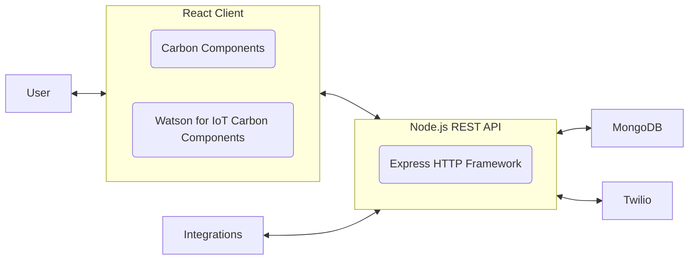
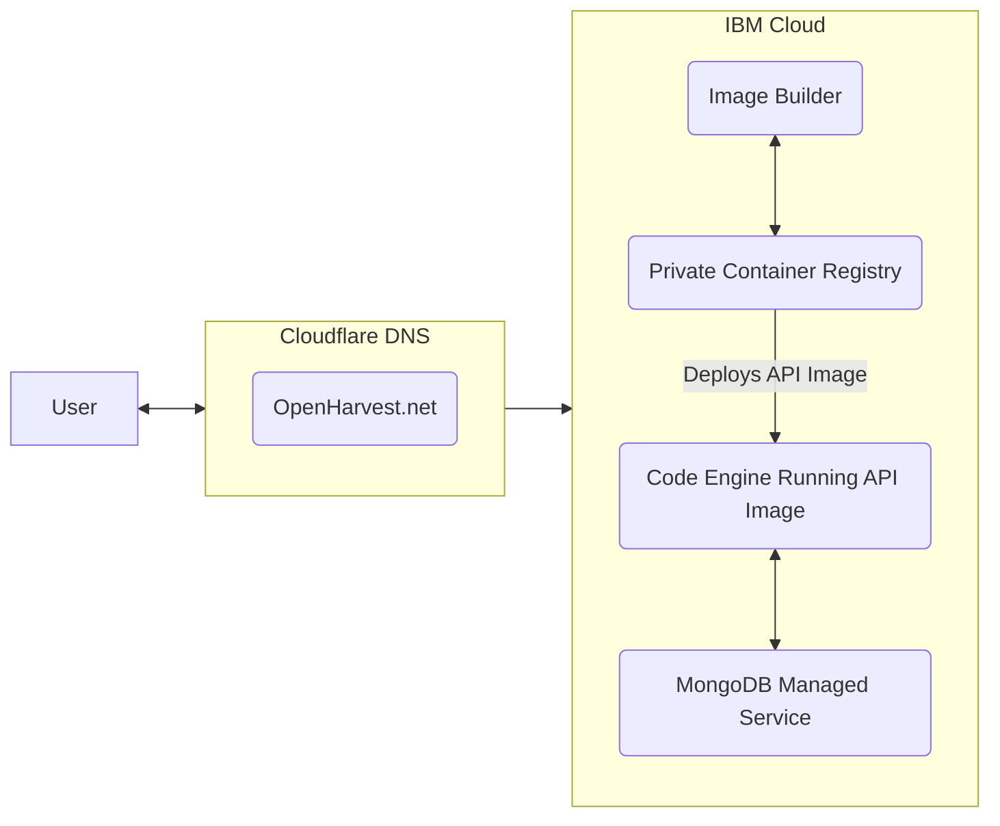

# OpenHarvest

[](https://www.apache.org/licenses/LICENSE-2.0) 


Open-Harvest Is a group submission and Second Place Winner for Global Challenge [Call for Code](https://developer.ibm.com/callforcode/)
## Contents


- [OpenHarvest](#openharvest)
  - [Contents](#contents)
  - [Demo video](#demo-video)
  - [The architecture](#the-architecture)
    - [Technology Stack](#technology-stack)
    - [Infrastructure / Deployment Stack](#infrastructure--deployment-stack)
  - [Long description](#long-description)
  - [Getting started](#getting-started)
    - [Prerequisites](#prerequisites)
    - [Building app](#building-app)
      - [backend](#backend)
      - [frontend](#frontend)
  - [Built with](#built-with)
  - [Authors](#authors)
  - [License](#license)
  - [Acknowledgments](#acknowledgments)


## Demo video
[](https://www.youtube.com/watch?v=6gZagLno-v8&t=10s)


## The architecture

### Technology Stack


### Infrastructure / Deployment Stack


## Long description
[More detail are available here](./DESCRIPTION.md)


## Getting started

### Prerequisites

* [node](https://nodejs.org/) and [npm](https://www.npmjs.com/) (Included with node)
* [git](https://git-scm.com/)
* [MongoDB](https://www.mongodb.com/)  Instructions on deploying and configuring this are included below

### Building app
#### backend
1. Install mkcert. For mac or linux: `brew install mkcert`. Windows user can download mkcert.exe from [Mkcert Github](https://github.com/FiloSottile/mkcert/releases) 
   
   Install ts-node for windows users in backend folder
   npm i -g ts-node
2. Create Certificates
   ```
   mkcert -install
   mkcert localhost 127.0.0.1
   ```
3. Create Mongodb Data Directory, anywhere you want but preferably in the same directory as the docker compose. This is optional for Windows user.
   ```
   mkdir {YOUR_PATH}
   ```
4. Create docker-compose.yml. For mac and linux
   ```
   version: '3.7'
   services:
    mongodb_container:
      image: mongo:latest
      environment:
        MONGO_INITDB_ROOT_USERNAME: {YOUR_ROOT_USER}
        MONGO_INITDB_ROOT_PASSWORD: {YOUR_ROOT_PASSWORD}
      restart: unless-stopped
      ports:
        - 27017:27017
      volumes:
        - {YOUR_MONGO_DB_DATA_DIR}:/data/db
   ```
   For windows:
   ```
   version: '3.7'
   services:
    mongodb_container:
      image: mongo:latest
      environment:
        MONGO_INITDB_ROOT_USERNAME: {YOUR_ROOT_USER}
        MONGO_INITDB_ROOT_PASSWORD: {YOUR_ROOT_PASSWORD}
      restart: unless-stopped
      ports:
        - 27017:27017
      volumes:
        - data:/mongodb/data/db
   volumes:
     data:
      driver: local
   ```
5. `cd` into `/backend` and rename `.env.example` to `.env` and replace the placeholder values.
   
6. 
      ```
        npm i
        npm start
      ```
  
#### frontend
  ```
  cd react-app
  npm install
  npm start
  ```
## Built with

- [Carbon Design System](https://github.com/Philipsty/carbon-angular-starter) - web framework used
- [IBM Cloudant](https://cloud.ibm.com/catalog?search=cloudant#search_results) - The NoSQL database used
- IBM Cloud
## Authors


- Team Lead: Tyler Philips
- Ravi Nain
- Ryan Pereira
- Vikas Jagtap

## License

This project is licensed under the Apache 2 License - see the [LICENSE](LICENSE) file for details.

## Acknowledgments

- Based on [Call For Code README template](https://github.com/Call-for-Code/Project-Sample/blob/main/README.md).
