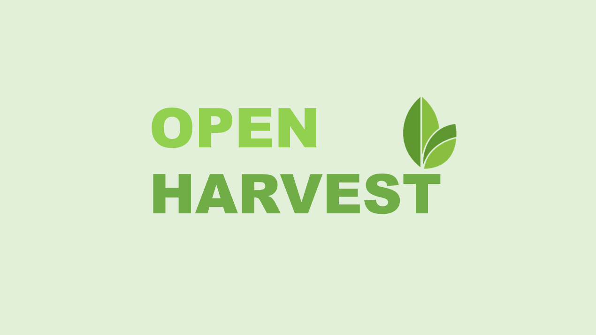
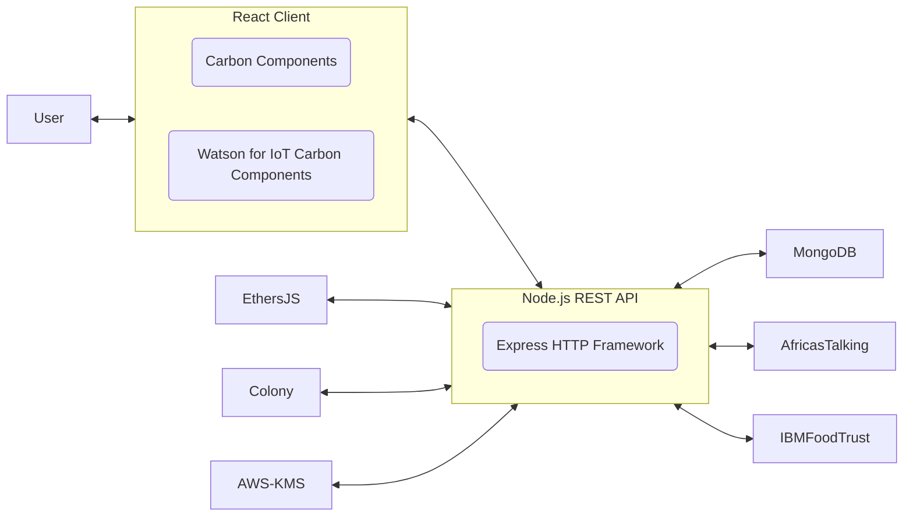
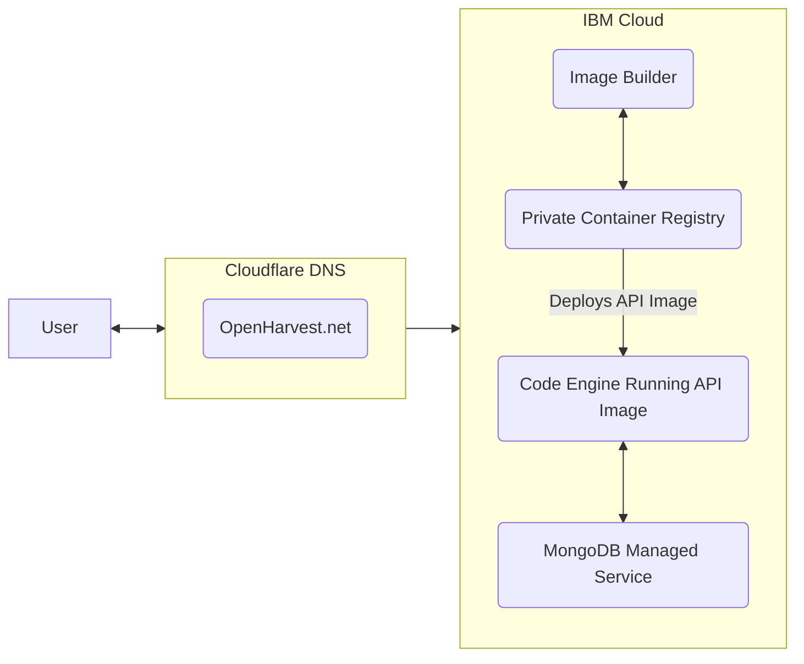

# OpenHarvest

[](https://www.apache.org/licenses/LICENSE-2.0)

OpenHarvest is a software platform that is developed based on the non for profit organization Heifer's requirements to help farmers in Malawi's ndichuma project. The platform is used by a co-op manager to keep track of farmers, fields, and crops. Displaying visual data and using the latest technologies to ensure farmer's succeed in growing their crops and making a profit. This is done by sending sms weather based recommendations for when specific tasks from the recommendation matrix should be performed as well as integrating weather forecasts and automatic data driven verification to confirm if farmers have performed the behaviour or not. Based on these behaviours the tool will allocate blockchain based reputation tokens which will be recorded for each farmer. Each farmer's reputation will be shared with Heifer as they will be working with financial institutions to provided lower rates for loans.

OpenHarvest is a winner in the 2021 [Call for Code](https://developer.ibm.com/callforcode/) IBM Challenge and has now been Open Sourced as part of the IBM [Sustainability Accelerator](https://newsroom.ibm.com/2022-02-17-IBM-launches-2-year-global-pro-bono-environmental-program-for-non-profits) program.

Follow us on Medium! https://medium.com/@openharvest

## Contents

- [OpenHarvest](#openharvest)
  - [Contents](#contents)
  - [Awards](#awards)
  - [Demo video](#demo-video)
  - [Demo URL](#demo-url)
  - [Architecture](#architecture)
    - [Technology stack](#technology-stack)
    - [Infrastructure / deployment stack](#infrastructure--deployment-stack)
  - [Long description](#long-description)
  - [Getting started](#getting-started)
    - [Prerequisites](#prerequisites)
    - [Building app](#building-app)
      - [Backend](#backend)
  - [Built with](#built-with)
  - [Authors](#authors)
  - [License](#license)
  - [Acknowledgments](#acknowledgments)
  
## Awards
Originally OpenHarvest was a submission for IBM's call for code challenge, a global competition to use code to create a solution to environmental issues such as sustainability. OpenHarvest was a web application designed to balance farming production in India. Farmers in India are struggling with marketing their crops. The greatest instance of this was with India's recent onion shortage. Essentially, farmers are being told that the market needs specific goods which results in a massive surplus as all the farmers dedicated their crops to the market's needs. This results in many farmers’ watching entire crops go to waste. These crops can take over a year to grow and leave the farmer in debt rather than making a profit. One of our group members has great insight into this issue as he has family in the farming industry.

OpenHarvest was a top solution created for the 2021 Call for Code IBMer Challenge. It took on a key agricultural challenge prompt in the [Call for Code](https://developer.ibm.com/callforcode/) competition.

## Demo video

[](https://www.youtube.com/watch?v=6gZagLno-v8&t=10s)

## Demo URL
This is built against master on request.

Available at: https://openharvest.net


## Architecture

### Technology stack



### Infrastructure / deployment stack



## Long description

[More details are available here](./DESCRIPTION.md)

## Getting started

### Prerequisites

- [Node](https://nodejs.org/) **minimim: v16** and [NPM](https://www.npmjs.com/) (Included with node)
- [Git](https://git-scm.com/)
- [MongoDB](https://www.mongodb.com/)  Instructions on deploying and configuring this are included below

### Building app

#### Backend

1. Install mkcert. For Mac or Linux: `brew install mkcert`. Windows user can download `mkcert.exe` from [Mkcert Github](https://github.com/FiloSottile/mkcert/releases)

   Install ts-node for Windows users in backend folder

   `npm i -g ts-node`

2. Create Certificates

   ```bash
   mkcert -install
   mkcert localhost 127.0.0.1
   ```

3. Create Mongodb data directory, anywhere you want but preferably in the same directory as Docker Compose. This is optional for Windows users.

   ```bash
   mkdir {YOUR_PATH}
   ```

4. Create docker-compose.yml.

   For Mac and Linux:

   ```bash
   version: '3.7'
   services:
    mongodb_container:
      image: mongo:latest
      environment:
        MONGO_INITDB_ROOT_USERNAME: {YOUR_ROOT_USER}
        MONGO_INITDB_ROOT_PASSWORD: {YOUR_ROOT_PASSWORD}
      restart: unless-stopped
      ports:
        - 27017:27017
      volumes:
        - {YOUR_MONGO_DB_DATA_DIR}:/data/db
   ```

   For Windows:

   ```bash
   version: '3.7'
   services:
    mongodb_container:
      image: mongo:latest
      environment:
        MONGO_INITDB_ROOT_USERNAME: {YOUR_ROOT_USER}
        MONGO_INITDB_ROOT_PASSWORD: {YOUR_ROOT_PASSWORD}
      restart: unless-stopped
      ports:
        - 27017:27017
      volumes:
        - data:/mongodb/data/db
   volumes:
     data:
      driver: local
   ```

5. Email openharvest@gmail.com to receive the .env file, `cd` into `/backend` and save file.

6. ```bash
   npm i
   npm start
   ```

note: if 'npm i' fails, add '--force'

#### Frontend

```bash
cd react-app
npm install
npm start
```

## Built with

- [Carbon Design System](https://github.com/Philipsty/carbon-angular-starter) - web framework used
- MongoDB - NoSQL database
- Node.js
- IBM Cloud

## Authors

- Tyler Philips
- Ryan Pereira
- Jonathan Scialpi
- Vikas Jagtap
- Ravi Nain

## License

This project is licensed under the Apache 2 License - see the [LICENSE](LICENSE) file for details.

## Acknowledgments

- Based on [Call For Code README template](https://github.com/Call-for-Code/Project-Sample/blob/main/README.md).
