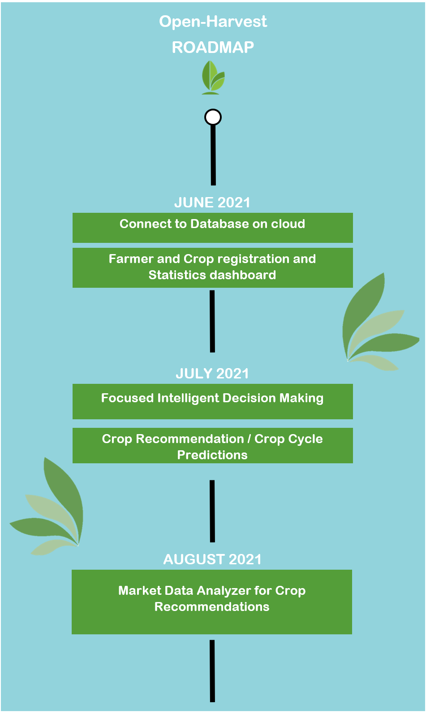

# CallForCode2021

 

Open-Harvest Is a group submission for [Call for Code](https://developer.ibm.com/callforcode/) 

## Contents

1. [Short description](#short-description)
1. [Demo video](#demo-video)
1. [The architecture](#the-architecture)
1. [Long description](#long-description)
1. [Project roadmap](#project-roadmap)
1. [Getting started](#getting-started)
1. [Built with](#built-with)
1. [Authors](#authors)
1. [License](#license)
1. [Acknowledgments](#acknowledgments)

## Short description

### What's the problem?

Farmers in India are struggling with marketing their crops. The greatest instance of this was with India's recent onion shortage. Essentially, farmers are being told that the market needs specific goods which results in a massive surplus as all the farmers dedicated their crops to the market's needs. This results in many farmer's watching entire crops go to waste. These crops can take over a year to grow and leave the farmer in debt rather than making a profit. One of our group members has great insight into this issue as he has family in the farming industry.

### How can technology help?
A central app for farmers to view the details of eachothers crops will allow them to make a more educated decision on what they will grow themselves to ensure profits.

### The idea
Open-Harvest is a technology designed for the government of India. Farmers will be able to publicly share the details of their crops/land to allow all farmers to stay informed on the best crops they can grow without risk of a surplus crisis. 
Ultimately we will balance farming production.

## Demo video

## The architecture

## Long description
[More detail are available here](./DESCRIPTION.md)

## Project roadmap

- Feature 1:Dashboard UI displaying land and crop statistics
- Feature 2: Farmer, crop, and lot registration
- Feature 3:Connected to NoSQL DB 

See below for our proposed schedule on next steps after Call for Code 2021 submission.

## Getting started

### Prerequisites

* [node](https://nodejs.org/) and [npm](https://www.npmjs.com/) (Included with node)
* [git](https://git-scm.com/)

./build.sh

## Built with

- [Carbon Design System](https://github.com/Philipsty/carbon-angular-starter) - web framework used
- [IBM Cloudant](https://cloud.ibm.com/catalog?search=cloudant#search_results) - The NoSQL database used

## Authors
- Tyler Philips
- Ravi Nain
- Ryan Pereira
- Vikas Jagtap

## License

This project is licensed under the Apache 2 License - see the [LICENSE](LICENSE) file for details.

## Acknowledgments

- Based on [Call For Code README template](https://github.com/Call-for-Code/Project-Sample/blob/main/README.md).
