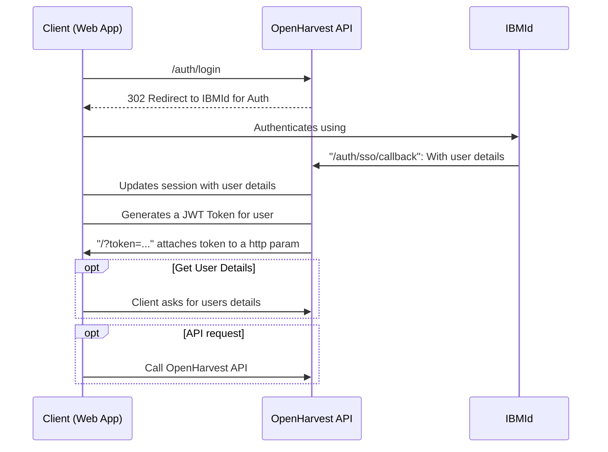

# Authentication
Authentication in OpenHarvest is a bit complicated with many places where verification is completed and data is stored and returned.

## User Authentication Steps
1. User navigates to https://openhavest.net/auth/login
2. API realises someone is trying to connect, redirect to IBMid
   1. We use `passport` & `passport-cu-oidc` strategy for auth middleware
   2. `passport-cu-oidc` uses our config to redirect automatically
3. User logs into IBMid via OAuth, OpenID
4. IBMid service calls back to `https://openhavest.net/auth/sso/callback` with the token
5. `passport-cu-oidc` is attached to this url, it parses and handles the data from IBMid
6. `passport-cu-oidc` executes our [function](https://github.com/Call-for-Code/OpenHarvest/blob/8c957bdffc570b786fbc7e971ac44c841d76c311/backend/src/auth/IBMiDStrategy.ts#L14) to populate their data and store it on the `req.user` object.
7. Our handler for `/auth/login` now executes and we can read `req.user` and create a new JWT using it.
8. We redirect back to the web application with the token as a http param: `https://openhavest.net/?token=...`
9. At this stage auth details are stored in the session based user storage and in the JWT token

This Sequence diagram attempts to explain it.

